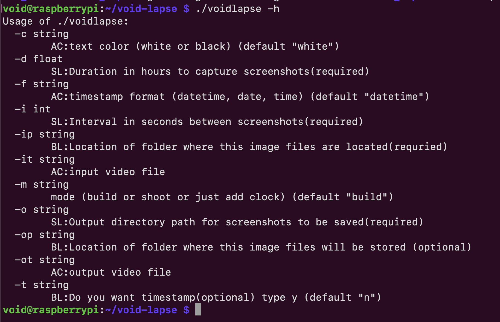

# Void Lapse  
Void Lapse is an easy-to-use, Linux-based timelapse creation tool written in Go. It simplifies the process of creating hours-long timelapses by providing an intuitive command-line interface.

  


---

## Features  
- **Three distinct modes:**
  1. **Shoot Mode (SL):** Captures images at regular intervals.
  2. **Build Lapse Mode (BL):** Converts captured images into a timelapse video.
  3. **Add Clock Mode (AC):** Adds timestamps to existing videos based on frame metadata.  
- Flexible timestamp customization options, including format and color.  
- Lightweight and designed for Linux environments.

---

## Installation  

### Prerequisites  
Ensure the following dependencies are installed:  

1. **Go Libraries:**  
   ```bash
   go get github.com/fogleman/gg
   go get github.com/u2takey/ffmpeg-go
   go get golang.org/x/image/font/basicfont
   ```
2. **System Dependencies:**  
   ```bash
   sudo apt-get install ffmpeg libavcodec-dev libavformat-dev libswscale-dev libv4l-dev
   sudo apt-get install -y v4l-utils \
       libgstreamer1.0-0 gstreamer1.0-plugins-base gstreamer1.0-plugins-good \
       gstreamer1.0-plugins-bad gstreamer1.0-plugins-ugly gstreamer1.0-libav \
       gstreamer1.0-tools gstreamer1.0-x gstreamer1.0-alsa \
       gstreamer1.0-gl gstreamer1.0-gtk3 gstreamer1.0-qt5 gstreamer1.0-pulseaudio
   ```

### Verify Camera Detection  
Plug in your webcam and verify detection:  

-  use it to see all the video ports. If you see video0 then your webcam is successfully connected
 ```bash
  ls /dev/video* 
 ``` 
 - check the webcam available or not 
 ```bash 
 lsusb
 ```
- This command adds the user here `void` to the `video` group, which grants access to video devices like webcams and GPUs.
  - **`-a` (append)**: Adds the user to the group without removing them from other groups.
  - **`-G`**: Specifies the group to add the user to.
```bash
 sudo usermod -a -G video void

```

- Install fswebcam (a simple command-line webcam utility)
```bash
sudo apt install fswebcam
```
- Capture an image using fswebcam:
``` bash
fswebcam --skip 60 --set brightness=70% test_image.jpg
```
- This command installs the **v4l-utils** package, which provides a collection of utilities for Video4Linux (V4L) devices. These tools are essential for managing and troubleshooting video devices such as USB webcams and digital video capture cards. It includes commands like `v4l2-ctl`, which allows you to query and change settings such as brightness, contrast, exposure, and resolution.
``` bash
sudo apt install v4l-utils
```
- to get the formats what our camera can support 
``` bash
v4l2-ctl --list-formats-ext |more
```


---

## How to Use  

### Setup  
```bash
go mod init voidlapse
go mod tidy
go build voidlapse
```
To see available flags:
```bash
./voidlapse -h
```


### Modes  

#### 1. **Shoot Mode (SL)**  
Captures images at regular intervals. Use the following flags:  
- `-d`: Duration in hours.  
- `-i`: Interval between each image in seconds.  
- `-o`: Output directory where the images will be stored.  

Example:  
```bash
./voidlapse -m shoot -d 0.014 -i 5 -o ./timelapse_photos
```

#### 2. **Build Lapse Mode (BL)**  
Converts captured images into a timelapse video. Use the following flags:  
- `-ip`: Input folder containing images from Shoot Mode.  
- `-op`: Output location for the timelapse video.  
- `-t`: (y or n) Add a timestamp to the video.  
- `-c`: Timestamp color (`white` or `black`).  
- `-f`: Timestamp format (`date`, `time`, or `datetime`).  

Example:  
```bash
./voidlapse -m build -ip ./timelapse_photos -op ./timelapse.mp4 -c white -f date -t y
```

#### 3. **Add Clock Mode (AC)**  
Adds timestamps to an existing video based on metadata. Use the following flags:  
- `-it`: Input video file.  
- `-ot`: Output video file with timestamps.  
- `-c`: Timestamp color (`white` or `black`).  
- `-f`: Timestamp format (`date`, `time`, or `datetime`).  

Example:  
```bash
./voidlapse -m timestamp -it ./timelapse_photos/timelapse.mp4 -ot ./timelapse_photos/ts_timelapse.mp4 -c white -f date
```

## I have used systemD timer to run the code for session management
- you can use tools like tmux as well
```bash
sudo nano /etc/systemd/system/voidlapse.service
```

```bash
[Unit]
Description=Voidlapse Service
After=network.target

[Service]
ExecStart=/path/to/voidlapse -m build -ip ./output -op ./output -c white -f datetime -t y
Restart=on-failure
User=pi
WorkingDirectory=/path/to/working/directory

[Install]
WantedBy=multi-user.target

```
#### reload:
```bash
sudo systemctl daemon-reload

```
#### enable the servcie to run:
```bash
sudo systemctl enable voidlapse
```
#### Start the service:
```bash
sudo systemctl start voidlapse

```
## stopping the service in the middle:
```bash
sudo systemctl stop voidlapse
```

# restarting the service
```bash
sudo systemctl restart voidlapse

```
# to check if the lapse is in progress or not
```bash
sudo systemctl status voidlapse
```
you can do the same for build as well as timestamp mode like
sudo systemctl status voidlapse-shoot
sudo systemctl status voidlapse-build
sudo systemctl status voidlapse-timestamp

after everychange run 
sudo systemctl daemon-reload
then start the service
---

## License  
I dont care about license.go play with it:)

---
